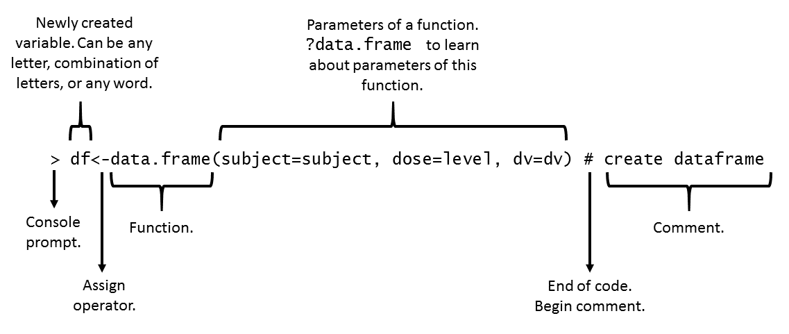

# Software


R is a programming language that is especially powerful for data exploration, visualization, and statistical analysis. To interact with R, we will use RStudio.

The following software is required for this workshop:

### R [Free]: The R Project for Statistical Computing.

- Download R for your platform here: https://cloud.r-project.org/
- Install

### RStudio [Free]: A powerful and productive user interface for R. It's free and open source, and works great on Windows, Mac, and Linux.

- https://www.rstudio.com/products/rstudio/download/
- Download and install
- Attention: Download and install R FIRST! from the link above.


#### Attention Mac users!

Some functions in R require an "X11 Server" and/or libraries associated with an X11 server. Apple does not provide this software with OS X anymore so you have to do it on your own via a third-party application called XQuartz.

1. Please close all the programs.
2. Go to http://xquartz.macosforge.org/landing/ and download the top-most "quick download" disk image file.
3. Double click the downloaded disk image then double click on the XQuartz.pkg and follow the installation
steps.
4. Please restart your machine.

# R Basics

R is a powerful language and environment for statistical computing. R is a freeware and can be installed on any computers for free. R is frequently used to analyze and visualize data in many scientific applications. R in combination with RStudio is a great option for educators as it allows easy data simulations, data analysis, and data visualization all within one powerful interface. This short tutorial will be covering basics of R use within RStudio interface. 

## RStudio layout

**Bottom left:** console window for typing simple commands.

**Top left:** editor window. Collection of commands (scripts) can be edited here using a simple word editor.

**Top right:** workspace/history window. Here you can view data and values loaded into R memory.

**Bottom right:** Files/plots/packages/help window. Here you can navigate and open your files, see your plots, load necessary package, and search for help.

## Getting help

1. The most productive way to get help, by far, is just to google your question. R has a thriving and vibrant community, it is almost certain that the answer is out there.

2. "A (very) short introduction to R" reading can be found at the end of this document (please refer to table of contents). This very short article describes all the basics of R and is a very helpful guide for those who need help with the material we cover in class.

3. The CRAN Introduction to R provides a more complete and detailed overview of the entire R language [http://cran.r-project.org/doc/manuals/R-intro.pdf]

4. Quick-R website has a great collection of articles for novice to advanced R users [http://www.statmethods.net/].

5. Once R is installed, there is a comprehensive built-in help system. At the program's command prompt you can use any of the following:

- help.start() # general help
- help(foo) # help about function foo
- ?foo # same thing
- apropos("foo") # list all functions containing string foo
- example(foo) # show an example of function foo
- vignette() # show available vignettes
- vignette("foo")# show specific vignette


## Creating and executing scripts

- Open RStudio
- Create new R script file: File ! New File ! R Script
- Save this script file in our Project folder (name it RScript)

In the editor window (newly created R script file) let's type:

```{r, eval=FALSE}

print("Hello world!")
```

Make sure that cursor is on the line with print("Hello world") and hit Ctrl+Enter 

R is a compiled or interpreted language. Your command will be immediately executed and you should see:

```{r, echo=FALSE}

print("Hello world!")
```


in the console window.


To execute a piece of code you can highlight that code and hit *Run* on the top right of your editor window. You can also place a cursor on the line of code you want to execute and hit *Ctrl+Enter* or hit Run at the top of your editor window.

## Using R as a calculator

In the command window after the ">" type:

```{r, eval=FALSE}
2+2
```

when you hit Enter you should see this output


```{r, echo=FALSE}
2+2
```

## Assignment operator

"<-" used to assign a value to a variable

### Example 1:

```{r, eval=FALSE}
cat<-2
dog<-3
cat*dog

```
```{r}

```

when you hit Enter you should see this output

```{r, echo=FALSE}
cat<-2
dog<-3
cat*dog

```


What we did is:

- we assigned 2 to variable "cat"
- we assigned 3 to variable "dog"
- we then multiplied those two variables

### Example 2:

```{r}
x <- c(1,2,3,4,5,6)
y<-x^2
print(y)
```


In the code above, "c" is a function that combines its arguments into a vector (a string of numbers).


```{r, eval=FALSE}
y <- x^2
```


Squares the elements of x and assign product to y


```{r, eval=FALSE}
print(y)
```

Print is a function that prints its argument on the screen.

```{r}
# Runing the code will produce this output.
# Note that "#" is used here to comment lines.
# Anything after "#" will not be passed for code evaluation by R

x <- c(1,2,3,4,5,6)
y<-x^2
print(y)
```

## Functions

### The anatomy of a Function. Typos averse



### Example 1: mean


To compute a mean you could type

```{r}
b<-(10+20+30)/3
b
```

but if vector is long this will take long time

the alternative is to use an existing function like mean()

For example:

```{r}
mean(x=b) # b is a vector we defined earlier
```


To compute a mean you could type

```{r}
b<-(10+20+30)/3
b
```

but if vector is long this will take long time

the alternative is to use an existing function like mean()

For example:

```{r}
mean(x=b) # b is a vector we defined earlier
```


### Example 2: rnorm

- rnorm() is an example of another existing function
- this function creates random numbers
- rnorm(10) will create 10 random numbers


### Example 3: rnorm with constraints

- rnorm() is an example of another existing function
- this function creates random numbers
- rnorm(10) will create 10 random numbers


If we need 10 random numbers with certain parameters:


- rnorm(10, mean=1.2, sd=3.4)
- This will output a normal distribution with mean 1.2 and standard deviation 3.4.

### Example 3: rnorm with constraints

If we need 10 random numbers with certain parameters:

- rnorm(10, mean=1.2, sd=3.4)
- This will output a normal distribution with mean 1.2 and standard deviation 3.4.

```{r}
rnorm(10, mean=1.2, sd=3.4)
```

### Example 4: histogram

```{r}
x=rnorm(100, mean=10, sd=1.2)
hist(x) # will output a histogram of x below
```


## Matrices

Matrices are two dimensional vectors. Lets define a matrix.

```{r}
mat=matrix(data=c(9,2,3,4,5,6, ncol=3))
```

1. argument data specifies which numbers should be in the matrix

2. ncol or nrow specify the number of columns or rows

3. elements of a matrix can be addressed: [row,column]

4. to select whole row leave the spot for column empty mat [2,]

5. functions also work with matrices mean(mat)

## Simple graphics

Plot:

```{r}
plot(rnorm(100), type="l", col="gold")
```


```{r}
rnorm(10, mean=1.2, sd=3.4)
```

### Example 4: histogram

```{r}
x=rnorm(100, mean=10, sd=1.2)
hist(x) # will output a histogram of x below
```


## Matrices

Matrices are two dimensional vectors. Lets define a matrix.

```{r}
mat=matrix(data=c(9,2,3,4,5,6, ncol=3))
```

1. argument data specifies which numbers should be in the matrix

2. ncol or nrow specify the number of columns or rows

3. elements of a matrix can be addressed: [row,column]

4. to select whole row leave the spot for column empty mat [2,]

5. functions also work with matrices mean(mat)

## Simple graphics

Plot:

```{r}
plot(rnorm(100), type="l", col="gold")
```


## Summaries

Create data frame:

```{r}
x1<-rnorm(100)
x2<-rnorm(100)
x3<-rnorm(100)
t<-data.frame(a=x1, b=x1+x2, c=x1+x2+x3)
```

Summary:

```{r}
summary(t)
str(t) # shows data types
head(t) # shows first few rows
tail(t) # shows last few rows
```

# Additional learning opportunities

1. Using assignment operator

* assign a single value to a variable (one letter or multiple letters such as a word)
* call that variable so it prints out an output

2. Basic manipulations with a single variable

* assign a single value to a variable (one letter or multiple letters such as a word)
* square that variable using (*) math operator and assign the result to a second variable
* divide the second variable (not the value) by 3 (make sure that your code outputs the result)

3. Creating and manipulating strings

* create three different vectors with a string of values in each vector
* get a mean for each vector
* get sd for each vector
* sum these vectors through variables

4. Working with strings

* assign a string of numbers to a variable
* assign a string of numbers to a second variable
* multiply the two variables and assign a product of this operation to a third variable
* call the third variable

# Session details

```{r}
devtools::session_info()
```

# <a href="/R_workshop" class="topic" style="color:red">Navigate Back</a>